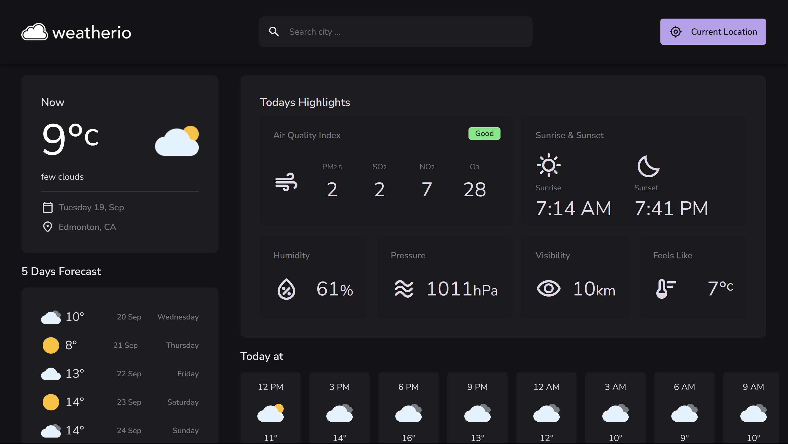

# weatherio
weather website

<p></p>

## Setup Environment
1. Ask Project owners for below file. We need this file while setting up project.
    1. /assets/js/keys.js

## Tech Stack
**Technology:** HTML, CSS, JavaScript, OpenWeather API

<h3>🛠️ Installation Steps:</h3>

<p>1. Clone the repository</p>

```
git clone https://github.com/imgagandeep/weatherio.git
```

<p>2. Start the development server</p>

```
Click on "Go Live"
```

<p>3. Access the application at</p>

```
http://localhost:5500
```
